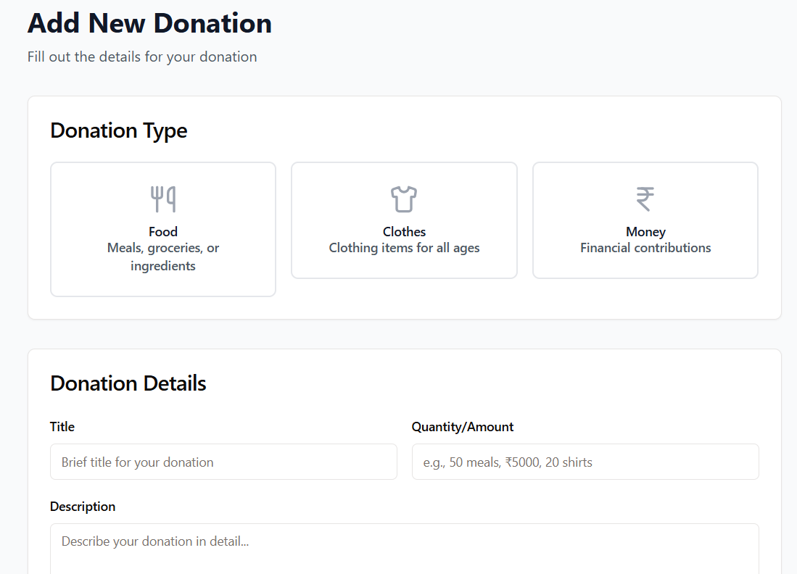
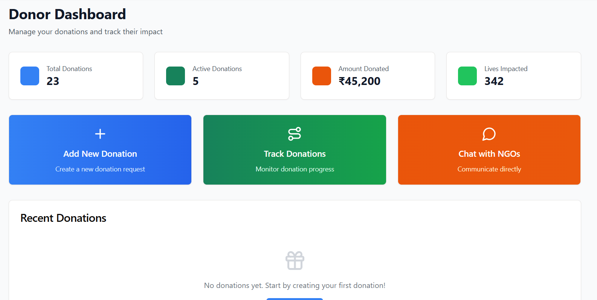
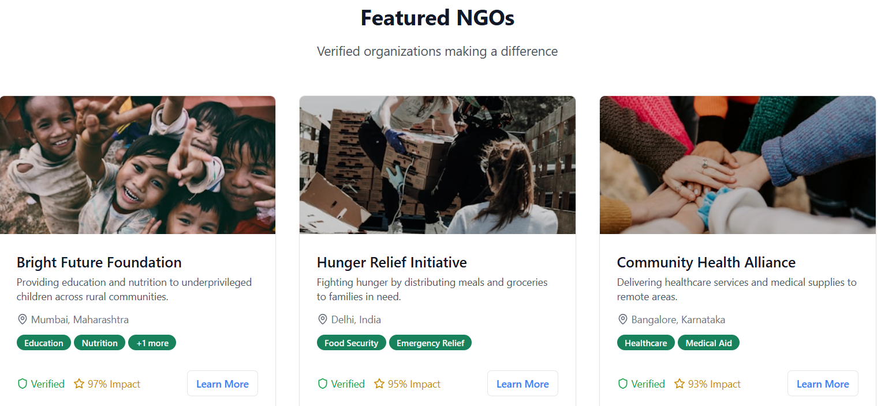
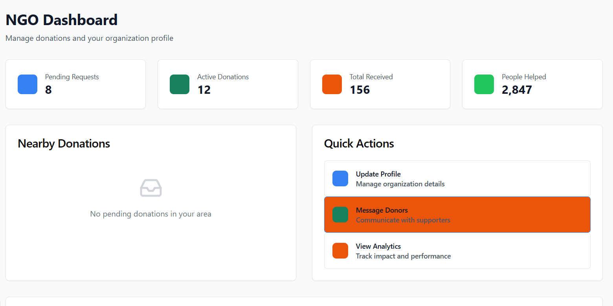
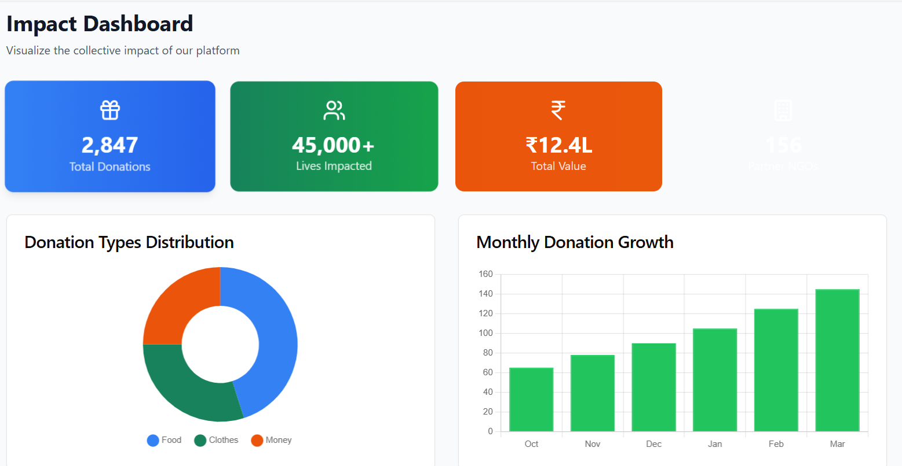
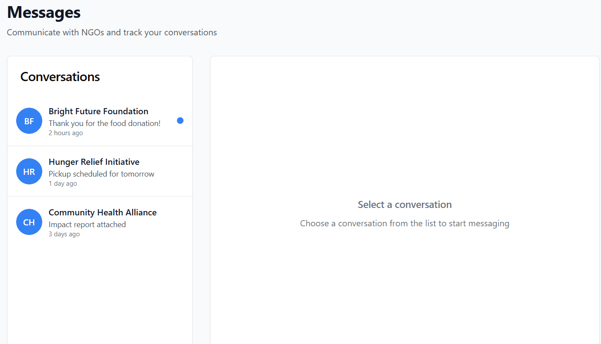

#  Sahyog – Smart Donation & Volunteer Management Platform

Sahyog is a community-driven platform designed to streamline the process of donating, volunteering, and organizing social causes. It connects NGOs, donors, and volunteers in a single digital space where kindness meets purpose.

---

##  Problem Statement

NGOs often face difficulties in managing donations, coordinating volunteers, and maintaining transparency with stakeholders. Donors and volunteers, in turn, struggle to find trusted platforms to contribute their time and resources. There is a pressing need for a unified system that simplifies and secures the donation and volunteering process.

---

##  Approach & Solution

Sahyog aims to solve this by providing a centralized digital platform that:

- Allows **donors** to contribute resources with transparency and tracking.
- Enables **volunteers** to discover, register, and participate in social initiatives.
- Empowers **NGOs** to manage donations, events, and campaigns effortlessly.
- Uses **AI tools** to support user queries and automate routine processes.

Our approach includes user role segmentation, real-time dashboards, and a clean, intuitive UI powered by modern web technologies.

---

##  Features

-  Role-based login for Donors, Volunteers, and NGO Admins  
-  Donation tracking (monetary & in-kind)  
-  Volunteer event registration and attendance tracking  
-  Event and campaign creation by NGOs  
-  Real-time analytics and dashboards  
-  AI chatbot assistance (LangChain + OpenAI integration)  
-  Responsive design for all devices  
-  Email notifications and updates  

---

##  Tech Stack

| Category        | Technology Used                             |
|----------------|----------------------------------------------|
| Frontend        | React, Tailwind CSS, TypeScript             |
| Backend         | Node.js, Express.js                         |
| Database        | Firebase Studio                             |
| AI & NLP        | LangChain, Gemini API                       |
| Deployment      | netlify,Streamlit                           |
| Others          | Git, GitHub Actions, dotenv                 |

---

## Screenshots

| Screenshot | Description |
|------------|-------------|
|  | **Advance Donation System** – Users select donation types like food, clothes, or funds and add details easily. |
|  | **Donor Dashboard** – View donations made, balance left, and access recent transactions. |
|  | **Featured NGOs** – Highlighted causes and registered NGOs for direct contribution or volunteering. |
|  | **NGOs Dashboard** – Manage campaigns, approve volunteers, and view recent donations. |
|  | **Impact Dashboard** – Visual reports showing donation value, types, and monthly trends. |
|  | **Real-Time Chatting System** – Instantly connect NGOs, donors, and volunteers via secure messaging. |

---

## Run Instructions

### Prerequisites
- Node.js (v14+)
- npm / yarn
- Python 3.8+ (for backend with Streamlit or Flask)
- MongoDB (local or Atlas)

